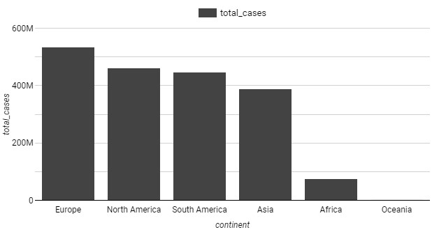
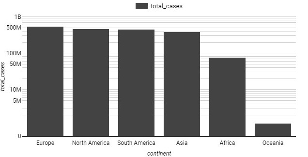
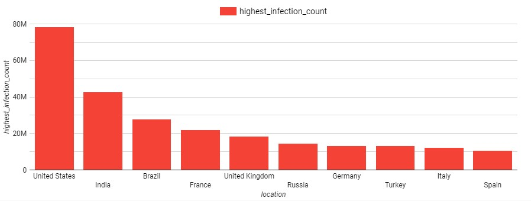
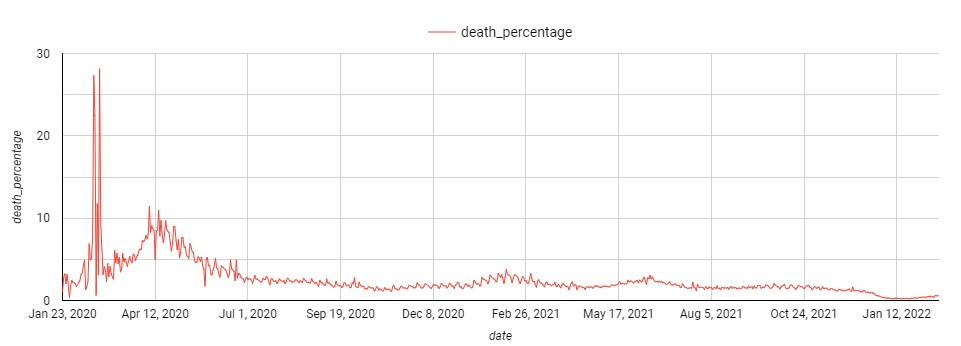

# Case Study 3 : Exploration of Covid - 19 Cases

**Coronavirus disease (COVID-19)** is an infectious disease caused by the 
SARS-CoV-2 virus.

Most people infected with the virus will experience mild to moderate 
respiratory illness and recover without requiring special treatment. 
However, some will become seriously ill and require medical attention. 
Older people and those with underlying medical conditions like
 *cardiovascular disease, diabetes, chronic respiratory disease, 
 or cancer* are more likely to develop serious illness. 
 Anyone can get sick with COVID-19 and become seriously ill or
  die at any age. 
  
  

The best way to prevent and slow down transmission is to be well informed
 about the disease and how the virus spreads. Protect yourself and others
  from infection by staying at least 1 metre apart from others, wearing a 
  properly fitted mask, and washing your hands or using an alcohol-based
   rub frequently. Get vaccinated when it’s your turn and follow local 
   guidance.

The virus can spread from an infected person’s mouth or nose in small 
liquid particles when they cough, sneeze, speak, sing or breathe. 
These particles range from larger respiratory droplets to smaller aerosols.
 It is important to practice respiratory etiquette, for example by coughing
  into a flexed elbow, and to stay home and self-isolate until you recover
   if you feel unwell.  
Source : [WHO](https://www.who.int/health-topics/coronavirus#tab=tab_1)

### Objective : Exploration of Covid 19 cases in BigQuery and Google Data Studio 

##  Ask 
- What percentage of population infected with Covid
- Countries with Highest Infection Rate compared to Population
- Countries with Highest Death Count per Population
- Percentage of Population that has recieved at least one Covid Vaccine

##  Prepare 
Data is taken from [COVID-19 Data Repository](https://ourworldindata.org/covid-deaths)  by the Center for Systems Science and Engineering 
(CSSE) at Johns Hopkins University.
Data is collected between  01/01/2020 and    17/02/2022

#### Is Data ROCCC?
A good data source is **ROCCC** which stands for **Reliable, Original, Comprehensive, Current,** and **Cited**.

- **Reliable -** *High* - Data is reliable 
- **Original -** *High* - Dta is Original
- **Comprehensive** - *High* - We have all needed parameters 
- **Current** - *High* - Data is up to date
- **Cited** - *High* - Source is verified

## Process 
global_covid_19 Database is created in BigQuery with two tables :
- covid_cases (16207 rows and 26 columns)
- covid_vaccination (16207 rows and 45 columns)

## Analyze & Share  

- Graph 1 has normal x - axis and Graph 2 has logarithmic scale .
- Logarithmic scales are useful when the data you are displaying is much less or much more than the rest of the data.
- In normal bar graph it seems Oceania has zero cases, so in order to visualise logarithmic scale used.

 

### Countries with highest infection rate

### Infection fatality ratio

## Findings
- United States has the highest infection rate followed by India.
- Faroe Islands has the highest frequency of COVID-19 in Europe with 62.32 % of infected population.
- Europe is the most affected continent followed by North America.
- United States, India and Brazil have the highest total death count.
